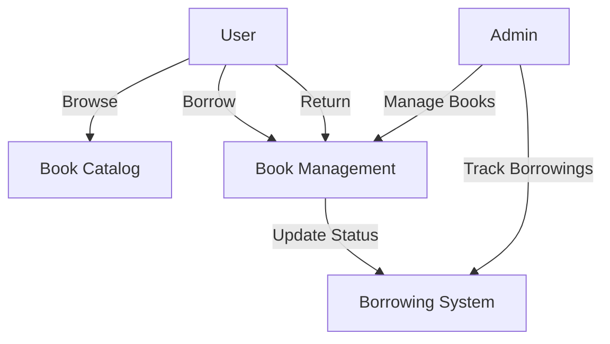
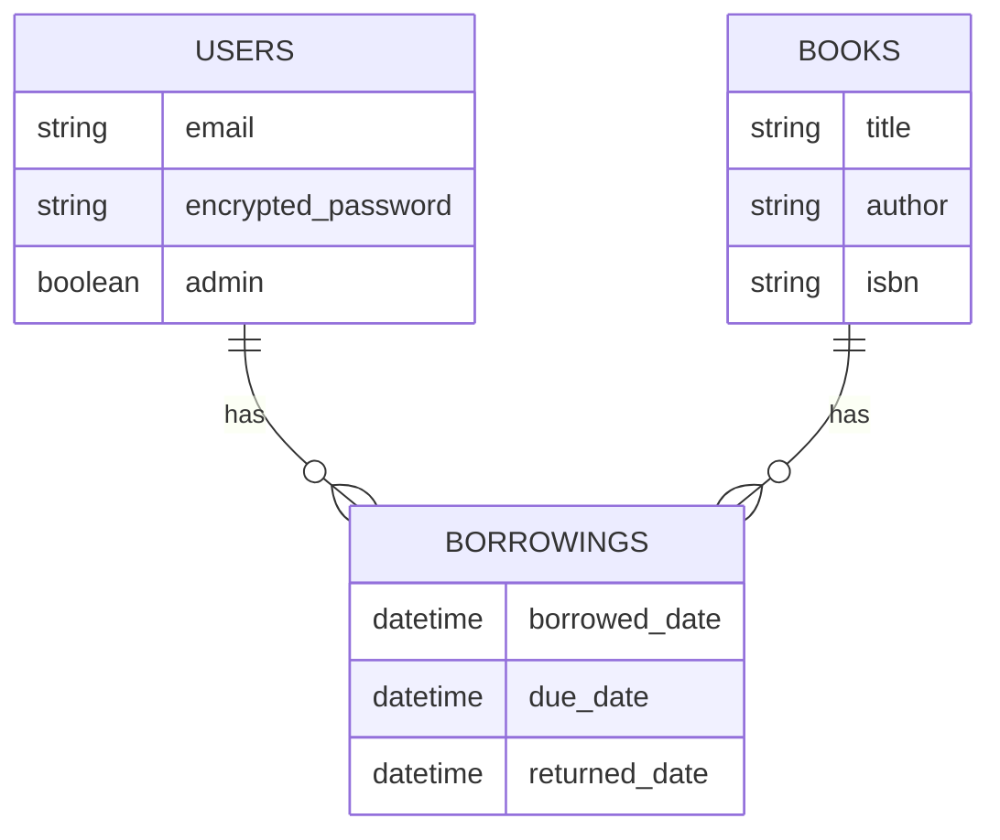

# 📚 Library Management System

A modern web application for managing library resources, book borrowing, and user interactions.


## 📋 Table of Contents
- [Overview](#overview)
- [Features](#features)
- [System Requirements](#system-requirements)
- [Installation](#installation)
- [Testing](#testing)
- [Usage](#usage)
- [Architecture](#architecture)
- [Deployment](#deployment)

## 🎯 Overview

The Library Management System is a Rails-based application that helps libraries manage their book inventory and user borrowing processes. It provides an intuitive interface for both users and administrators to handle library operations efficiently.



## ✨ Features

### For Users
- Browse available books
- View book details
- Borrow and return books
- Track borrowing history
- Personal profile management

### For Administrators
- Manage book inventory
- Add new books
- Monitor book status
- Track borrowing records
- User management

## 💻 System Requirements

- **Ruby**: 3.4.1
- **System Dependencies**:
  - curl
  - libjemalloc2
  - libvips
  - sqlite3

## 🚀 Installation

1. Clone the repository:
```bash
git clone [repository-url]
cd library-system
```

2. Install dependencies:
```bash
bundle install
```

3. Set up the database:
```bash
rails db:create
rails db:migrate
```

4. Start the server:
```bash
rails server
```

## 🧪 Testing

The application includes comprehensive test coverage:

```bash
# Run all tests
bundle exec rspec

# Run specific test categories
bundle exec rspec spec/models
bundle exec rspec spec/controllers
bundle exec rspec spec/system
```

Test coverage includes:
- Model validations and relationships
- Controller actions and authentication
- System/integration tests
- User flow testing

## 📱 Usage

### User Interface

The application provides an intuitive interface for managing library resources:

```
Home
├── Books
│   ├── View All Books
│   ├── Book Details
│   └── Borrow/Return
├── My Profile
│   ├── Current Borrowings
│   └── Borrowing History
└── Admin Panel
    ├── Add Books
    └── Manage Inventory
```

### Authentication

- User registration and login
- Admin privileges for library staff
- Secure authentication using Devise

## 🏗 Architecture

### Database Schema



### Key Components

- **Models**: User, Book, Borrowing
- **Controllers**: Books, Borrowings, Profiles
- **Views**: ERB templates with modern UI
- **Authentication**: Devise
- **Background Jobs**: Solid Queue
- **Real-time Features**: Action Cable

## 📦 Deployment

The application supports multiple deployment options:

- **Docker**: Containerized deployment using included Dockerfile
- **Kamal**: Deployment configuration in `config/deploy.yml`
- **Traditional**: Standard Rails deployment

### Configuration Files

- `config/database.yml`: Database configuration
- `config/cable.yml`: WebSocket configuration
- `config/cache.yml`: Caching settings

## 📄 License

This project is licensed under the MIT License - see the LICENSE file for details.

## 🤝 Contributing

Contributions are welcome! Please feel free to submit a Pull Request.

## 📞 Support

For support, please open an issue in the GitHub repository or contact the development team.